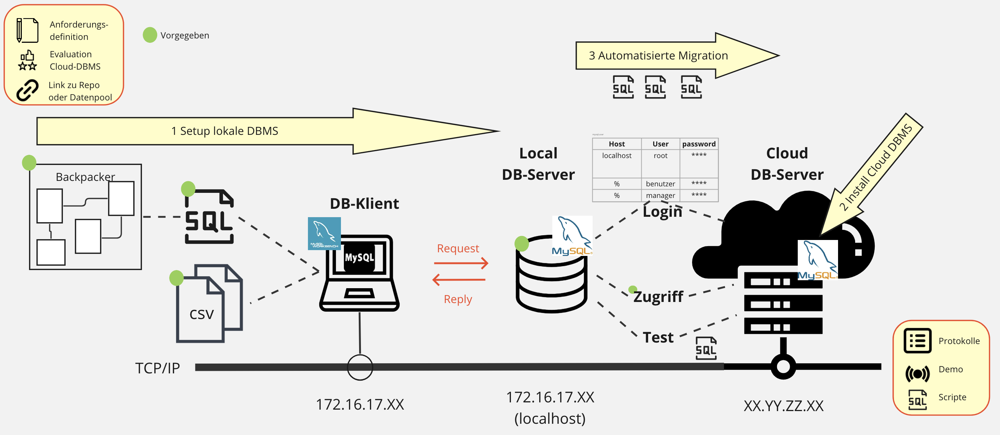

# M141 - DB-Systeme in Betrieb nehmen (8. - 10.Tag)

*Autor: Kellenberger Michael 2024*

# User Story

Eine kleine Jugendherberge verwaltet ihre Übernachtungen und die Zugänge der Angestellten (Benutzer) in einer kleinen Access-Datenbank. Nun möchte der Betreiber die Datenbank (Backpacker) auf eine schnellere MySQL-Datenbank umstellen.  Er hat die bestehende Struktur in einem SQL-DDL-Skript und die Daten als CSV-Datei abgelegt. Die Struktur und die Daten sind möglicherweise nicht ganz konsistent, was überprüft werden sollte: Nach dem Laden der Datenbasis in ein lokales DBMS soll diese konsolidiert werden (Testen und Optimieren). Für den produktiven Betrieb soll die Datenbasis dann auf einem evaluierten, sicheren Cloud-DBMS laufen, d.h. dorthin migriert werden.

# LB3 Praxisarbeit: Backpacker_LB3 migrieren

**Product Backlog**

| # |  Einträge   (Arbeitspakete)  | Vorgaben  | Kompetenzfeld | Punkte |
|---|---|---|---|:--:|
| 0 | **Definition Infrastruktur**  | - **Anforderungsdefinition**: Ausformulierung der Praxisarbeit gemäss folgender Punkte (SMART)   - **Evaluation** Cloud RDBMS   - **Link zu Repo/Datenpool**  | E1 | 4|
| **1** | **Lokale DBMS**  | **Z.B. MariaDB (XAMPP)**  | | |
| 1.1 |  - *ERD 2.NF*  | Gegeben: [Backpacker-Schema](backpacker_lb3.png), [Backpacker DDL](./backpacker_ddl_lb3.sql) | A1 A2 | |
| 1.2 |  - *Zugriffsmatrix* | Gegeben: Zugriffsmatrix siehe unten | A1 | |
| 1.3 |  - Zugriffs-berechtigungen | - Gemäss Zugriffsmatrix (mind. ein Benutzer pro Gruppenrolle)    - SQL-Scripts (DCL) | D1 C1 | 4|
| 1.4 |  - DB Daten | - Import [Backpacker CSV-Dateien](./backpacker_lb3.csv.zip)    - SQL-Scripts (DML)   - DB bereinigen (Index, Constraints) | B1 | 4 |
| 1.5 |  - Testen | - Testprotokolle Rollen, Benutzer, Datenkonsistenz   - SQL-Scripts (Testdaten für Migration) | C2 | 4 |
| **2** | **Remote Cloud-DBMS**    | **Z.B. MariaDB (AWS[\*](https://gitlab.com/ch-tbz-it/Stud/m164/-/tree/main/01_Installation_SW/AWSCloud?ref_type=heads))**  | | |
| 2.1 | - Setup Cloud DBMS   | Installation und Setup   | A1 | 4 |
| 2.2 | - Betrieb  | - Cloud DBMS für produktiven Betrieb gesichert <b> - Konfigurationen (.ini) für prod. Betrieb| A2 C1 | 4 |
| **3** | **Automatisierte Migration**  |  **Lokale DBMS auf Cloud-DBMS migriereren** | | |
| 3.1 |  - Berechtigungen  | - Zugriffsberechtigungen übertragen   - SQL-Scripts (DCL) | D1 | 4|
| 3.2 |  - Daten  | - Struktur und Daten übertragen   - SQL-Scripts(DDL & DML)   - DB bereinigen | B1 C1| 4|
| 3.3 |  - Testen  | - Testprotokolle Rollen, Benutzer, Datenkonsistenz anhand der Testdaten der lokalen DB)   - SQL-Scripts | C2 |   4|
| **4** | **Protokollierung** | Punkte 1.x -3.x nachvollziehbar dokumentiert | E1 | 4 |
| | ***!! Demo !!***  | + Demo 3 User auf Cloud-RDMS vor LP   + Testscript LP (SQL)   + Dauer: 10-15 Min ! | | 4 |
| |   | | | _________ |
|  |   | Max. Punkte: (Note 6)| | 44 |

**Zugriffsmatrix**

|  *DB backpacker\_lb3*     |                |       |       |       |
|---------------------------|----------------|-------|-------|-------|
| *Benutzergruppe:*         | **Benutzer**   |       |       |       |
| Tabellen - Attribute      | S              | I     | U     | D     |  
| tbl\_personen             | **x**          |       | **x** |       |  
| tbl\_benutzer             |                |       |       |       |  
| **-** Passwort            | --             | --    | --    | --    |  
| **-** deaktiviert         | **x**          | --    | --    | --    | 
| **-** restliche Attribute | **x**          | **x** | **x** | --    |  
| tbl\_buchung,   tbl\_positionen | **x**          | **x** | **x** | **x** |   
| tbl\_land,    tbl\_leistung   | **x**          |       |       |       |

|  *DB backpacker\_lb3*     |                |       |       |       |
|---------------------------|----------------|-------|-------|-------|
| *Benutzergruppe:*         | **Management**   |       |       |       |
| Tabellen - Attribute      | S              | I     | U     | D     |  
| tbl\_positionen,   tbl\_buchung             | **x**          |       |       |       |  
| restl. Tabellen           | **x**          | **x** | **x** | **x** |   

*S = Select, I = Insert, U = Update, D = Delete, -- = nicht möglich, - = nicht mehr möglich*

**Rahmenbedingungen**

* **Zeitbudget**: 9-12 Lektionen + Heimarbeit (2 Wo)
* **Gruppenform**: Partnerarbeit oder Einzelarbeit (*Bonus bei Einzelarbeit*)
* **Dokumentation**: Auftragsdefinition, Testprotokolle, Testprotokolle (Lokal/Cloud), Protokollierung der Arbeitspakete, Erläuterungen zu Konfigurationsparameter
* **Scripte**: Alle zur Erstellung, Migration und Test benutzten SQL-Scripts
* **Bewertung**: Punkteraster gemäss obiger Tabelle   (0=fehlt/unbrauchbar, 1=ungenügend/Teil fehlt o. falsch, 2=genügend/minimal,   3=gut/erfüllt, 4=sehr gut/zusätzlich/hervorragend)   **Note = P * 4 / Pmax + 2** (Note 1 bei fehlender Abgabe)

